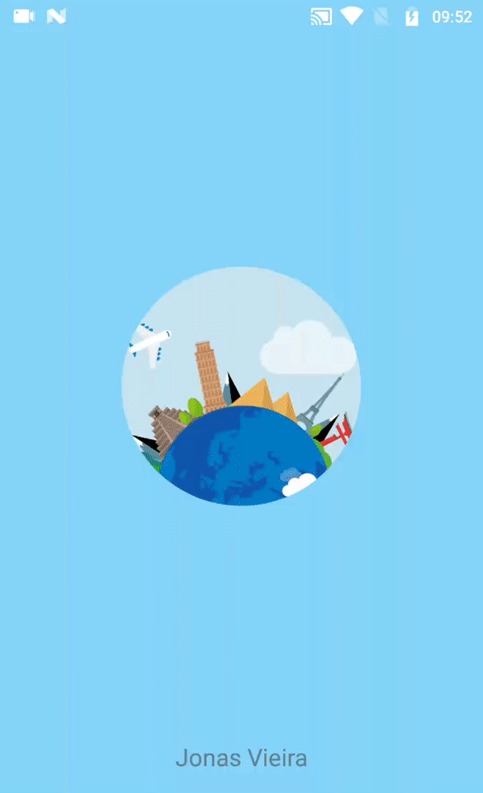

# RelogioLottie
App RelogioMundial com exemplificação de utilização da biblioteca Lottie de animações via Json usando Kotlin

## Screenshots 

  

## Author 

* Jonas Vieira - jonasvieira.ti@gmail.com  
 

